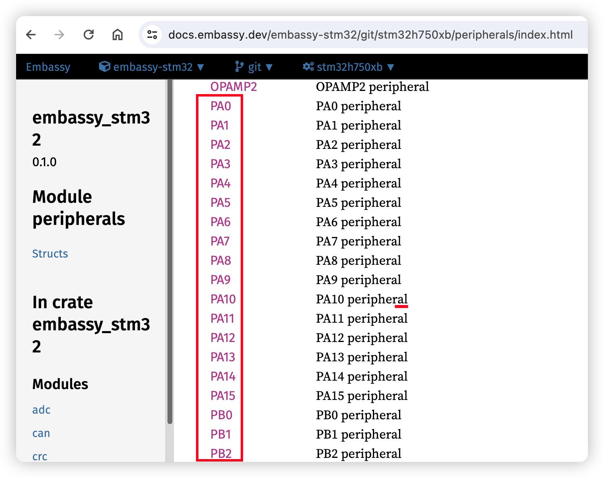

# Keyboard Matrix

This section covers the basic keyboard identification and physical matrix configuration in your `keyboard.toml` file.

## Matrix Configuration

The `[matrix]` section defines your keyboard's physical key matrix wiring. This tells RMK which GPIO pins connect to your key switches.

::: info
**Skip `[matrix]` section for split keyboards**. Use the `[split.central/peripheral.matrix]` section to define matrix configuration for split central and peripherals.
:::

### Understanding Key Matrix

A keyboard matrix uses diodes to enable multiple key detection. Here's how it works:

```
Output Pin (Column) → |>| → Input Pin (Row)
                      ↑
                   Diode (note direction)
```

By default, RMK assumes that your pins are **col2row**, meaning that the output pins (anodes) represent the columns and the input pins (cathodes) represent the rows. If your schematic shows the opposite, you need to [change the configuration to **row2col**](../getting_started/faq#my-matrix-is-row2col-the-matrix-doesnt-work)


### Standard Matrix Configuration

For keyboards using a traditional diode matrix:

```toml
[matrix]
# Define matrix pins
row_pins = ["PD4", "PD5", "PD6", "PD3"]
col_pins = ["PD7", "PD8", "PD9"]

# RMK uses col2row as the default matrix diode direction, if you want to use a row2col matrix, add `row2col = true`
# row2col = true

# Debouncer mode: "default"(can be ignored) or "fast"
# debouncer = "fast"
```

### Finding GPIO Pin Names

GPIO pin names vary by microcontroller. Here are the correct formats for each supported chip series:

**Examples by Chip Series:**

- **STM32**: `PA0`, `PB1`, `PC2`, etc.
- **nRF52**: `P0_00`, `P0_01`, `P1_15`, etc.
- **RP2040/RP2350**: `PIN_0`, `PIN_1`, `PIN_28`, etc.
- **ESP32**: `GPIO0`, `GPIO1`, `GPIO21`, etc.

**Finding Pin Names:**

1. Visit [Embassy docs](https://docs.embassy.dev/)
2. Navigate to your specific chip (e.g., `embassy-stm32/stm32h750xb`)
3. Check the peripherals module for valid GPIO pin names:
   

### Matrix Type Configuration

RMK supports two matrix types:

```toml
[matrix]
# Default: normal matrix with diodes
# matrix_type = "normal"  # This is the default, can be omitted

# Or: direct pin connection (no matrix)
matrix_type = "direct_pin"
```

### Direct Pin Configuration

For keyboards where each switch connects directly to a GPIO pin (no matrix):

```toml
[matrix]
matrix_type = "direct_pin"

# 2D array representing your direct-pin matrix
direct_pins = [
    ["PIN_0", "PIN_1", "PIN_2"],
    ["PIN_3", "_",     "PIN_5"]
]

# Pin behavior (default: true = active low with pull-up)
direct_pin_low_active = true
```

**Direct Pin Behavior:**

- `true` (default): The pin is pulled high by default, pressing a key pulls it to low
- `false`: The pin is pulled low by default, pressing a key pulls it to high
- Use `"_"` or `"trns"` for unused positions in the matrix

### Bootmagic - Bootloader Recovery via a Held Key

Bootmagic lets you drop into the chip's USB bootloader (e.g. BOOTSEL mode on RP2040) by holding a designated key while the firmware boots. This is useful if the physical BOOTSEL/RESET button can't be reached without disassembling the keyboard. For a unibody keyboard:

```toml
[matrix]
bootmagic = [0, 0] # (row=0, col=0), typically the ESC key
```

For direct-pin matrices, the same syntax works; the configured cell must point to a real pin (not `"_"`/`"trns"`). RMK will refuse to compile if you reference a placeholder cell.

For a split keyboard, configure each half independently:

```toml
[split.central.matrix]
bootmagic = [0, 0]

[split.peripheral.matrix]
bootmagic = [0, 0]
```

Note the sides are commonly mirrored, so this configuration might refer to the outermost column for each side.

::: warning
**Do not unplug or reseat a TRRS connector joining halves of a split keyboard.** This is tempting when flashing the peripheral side, but TRRS connectors short adjacent ring contacts as the plug slides in or out, which on a split keyboard typically means momentarily shorting `VCC` to `GND` (or to a data line) across the connector. That can permanently damage the MCU on either half.

A safe procedure to flash the peripheral side:

1. Remove USB connector between central side and host.
2. Attach USB connector between peripheral side and host, while holding the peripheral side's bootmagic key.
3. Flash.
4. Remove USB connector between peripheral side and host.
5. Restore USB connector between central side and host.
   :::

**Bootmagic Behavior:**

- The scan runs once at boot, before the keyboard task or USB enumeration, and adds ~50µs to boot time when configured

If `bootmagic` is omitted, no scan is performed and there is zero runtime overhead.

### Debouncer

RMK has two debouncer modes, "default" and "fast":
- The default mode uses a counter-based algorithm that registers a key only after its counter exceeds a certain threshold.
- The fast mode, on the other hand, reacts instantly to a key press and then waits briefly before accepting the next input.

If no `debouncer` is set, the matrix will default to `default` mode.

## Vial Unlock Keys - `[host]` Section

For enhanced security, Vial locks certain functions (like matrix testing) by default. You can set a key combination to unlock it. This configuration is part of the `[host]` section which controls host-side tools and features.

```toml
[host]
# Unlock combination: simultaneous press of specified keys
# Format: [[row, col], [row, col], ...]
unlock_keys = [[0, 0], [0, 1]]  # Keys at (row=0,col=0) and (row=0,col=1)
```

::: tip
- The unlock keys use the physical matrix position (row, column), not the keycode
- Choose keys that are easy to press simultaneously but not commonly pressed together accidentally
- See the [Vial Support](../features/vial_support.mdx) page for more details on Vial configuration
:::

## Troubleshooting

### Common Issues

**Wrong GPIO Pin Names:**

- Check embassy documentation for your specific chip
- Ensure pin names match exactly (case-sensitive)
- Verify pins support GPIO functionality
- Use correct format: `P0_00` (nRF52), `PIN_0` (RP2040), `PA0` (STM32), `GPIO0` (ESP32)
- For nRF52, some pins are behind a feature gate, for example `P0_09/P0_10` are used as NFC pins by default. To use it as a normal pin in matrix, you should enable corresponding features(for example, [nfc-pins-as-gpio](https://github.com/embassy-rs/embassy/blob/main/embassy-nrf/Cargo.toml#L86)) for `embassy-nrf` dependency.

**Matrix Not Working:**

- Verify diode direction in your schematic
- Check if you need `row2col = true`, add it to your matrix section if you need

**Direct Pins Not Working:**

- Verify `matrix_type = "direct_pin"` is set
- Check `direct_pin_low_active` setting matches your hardware
- Ensure unused positions use `"_"` or `"trns"`
