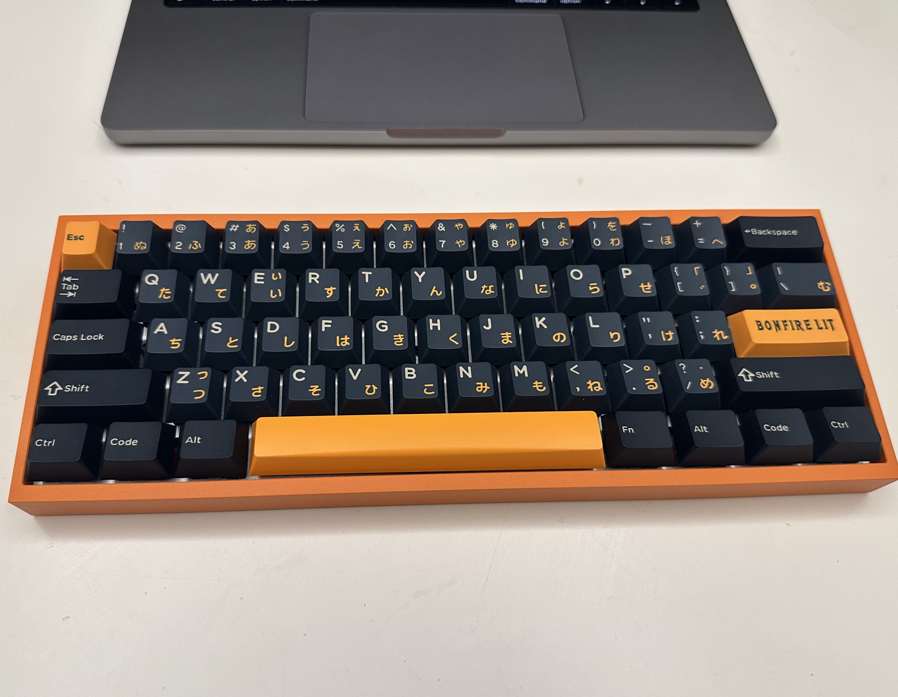
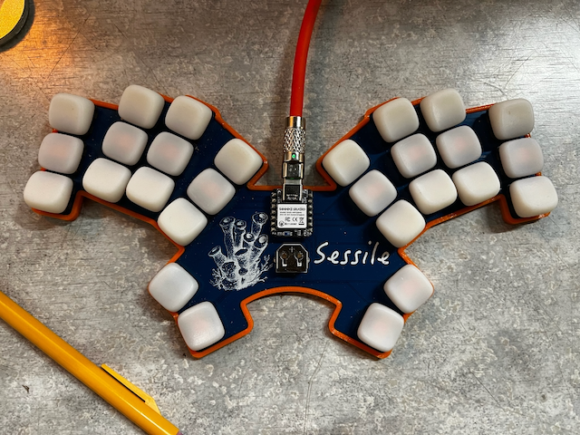
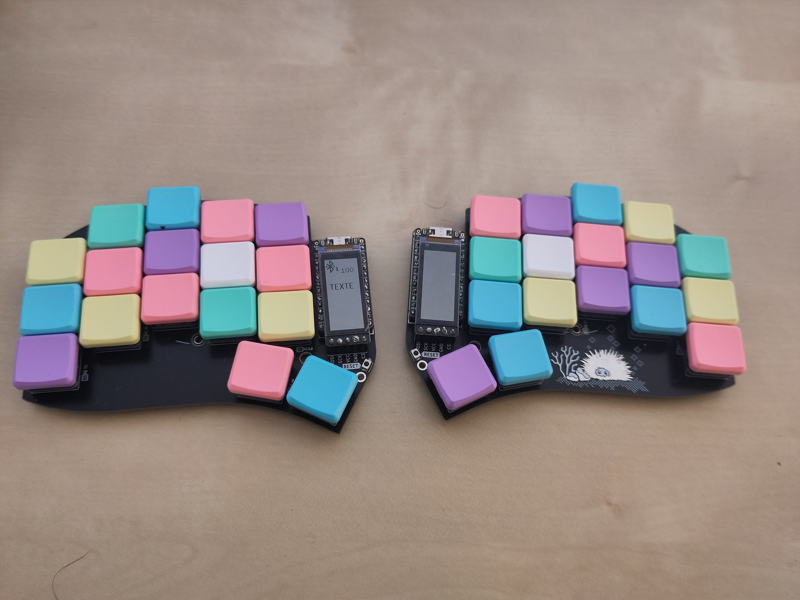

# Real World Examples

This page contains real world examples of RMK keyboards.

## [rmk-ble-keyboard](https://github.com/HaoboGu/rmk-ble-keyboard)

A BLE/USB dual-mode GH60 keyboard using Ebyte's E73 nRF52840 module.

## [dactyl-lynx-rmk](https://github.com/whitelynx/dactyl-lynx-rmk)

## [sessile](https://github.com/willpuckett/sessile)

_Sessile_ is an exploration of "minimal" finger travel. You can also read its circuitous [origin story](https://kbd.news/Typing-in-the-upside-down-2603.html).

## [Urchin](https://github.com/TimoBbz/urchin-rmk-firmware)

A firmware for the [Urchin Keyboard](https://github.com/duckyb/urchin), to use with the layout [Ergo-L](https://ergol.org/).

## [zx66](https://github.com/zongxin1993/zx66-keybord)

A modular split 66-key keyboard

## Show your keyboard!

If you're using RMK to build your keyboard, feel free to open a PR adding your project to this page!
