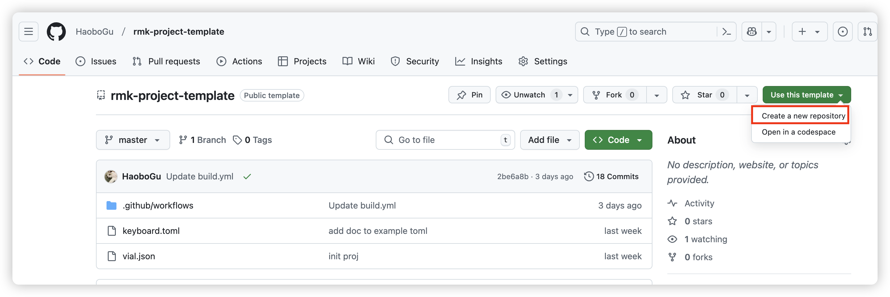
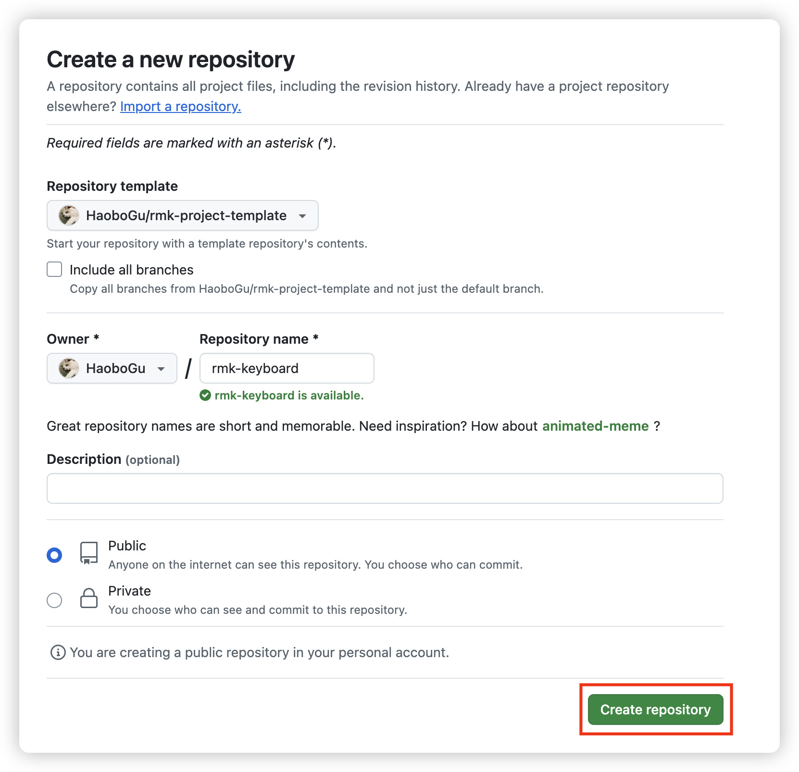
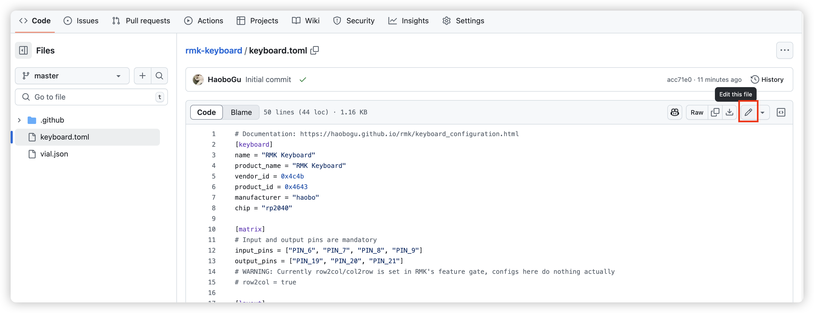
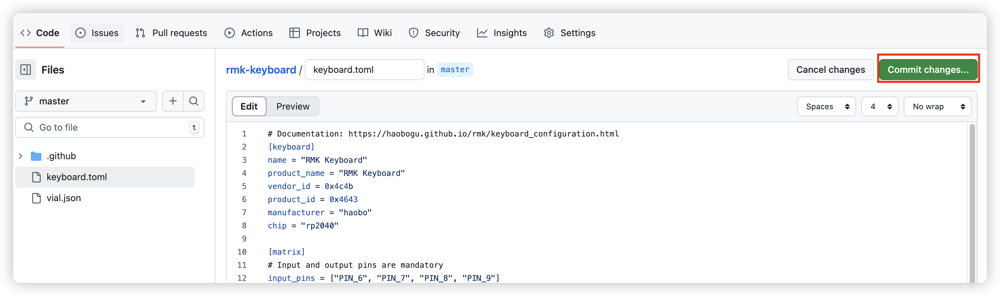
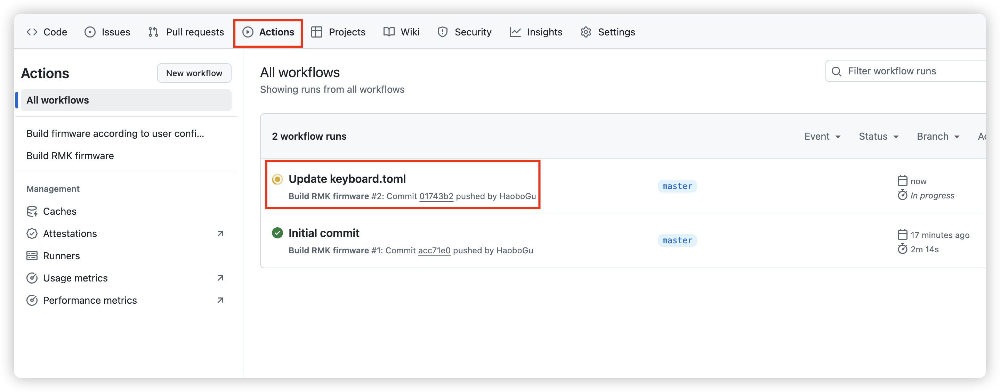
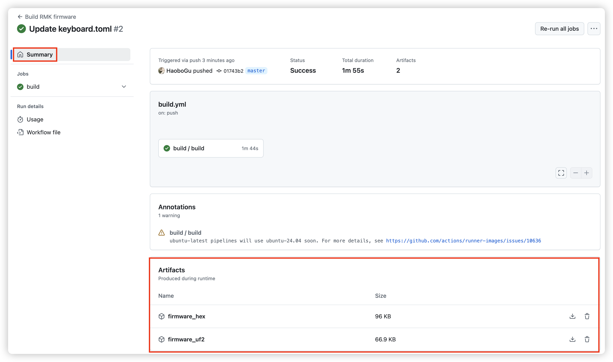

# Cloud compilation

RMK provides a [project-template](https://github.com/HaoboGu/rmk-project-template) that you can use to create your firmware easily. The following is a step-by-step tutorial for compiling RMK firmware using Github Actions.

::: info

There are some limitations currently for cloud compilation via Github Actions. For example, you cannot edit cargo features in the generated project. If you have any problems when compiling RMK on the cloud, please [open an issue](https://github.com/HaoboGu/rmk/issues/new)!

:::

## Steps

1. To get started, open [project-template](https://github.com/HaoboGu/rmk-project-template), click `Use this template` button and choose `Create a new repository`:

2. Set your repository name, and click `Create repository`

3. Navigate to your created repository, there are two config files in the project：`keyboard.toml` and `vial.json`:
   - `keyboard.toml`: this file defines almost everything about your keyboard, follow [keyboard configuration](../../configuration) to create your own keyboard definition
   - `vial.json`: this file contains matrix definitions which will be recognized by [vial](https://get.vial.today/). RMK now uses vial to update the keymap on-the-fly. Follow vial's [porting guide](https://get.vial.today/docs/porting-to-via.html) to create `vial.json` for your keyboard.

   you can edit the files directly on Github by clicking the file and then choosing `edit this file`: . After updating your config, click `Commit changes..` to save it: 

4. Once you saved your file, Github Action will automatically run to compile your firmware using your saved config files. Click `Action` tab on the top bar and you can see there's a workflow running. 

   You can also check the compilation log by clicking `build/build`. After the compilation finished, refresh the page and you can see the compiled RMK firmware under `Summary/Artifacts`:

   

5. Now you get your RMK firmware! RMK provides `hex` and `uf2` firmware that you can use. 

## Next Steps

import { LinkCard } from '@theme';

<LinkCard
      href="../flash_firmware"
      title="️Flashing Firmware"
      description="Flash the firmware to your microcontroller"
/>

