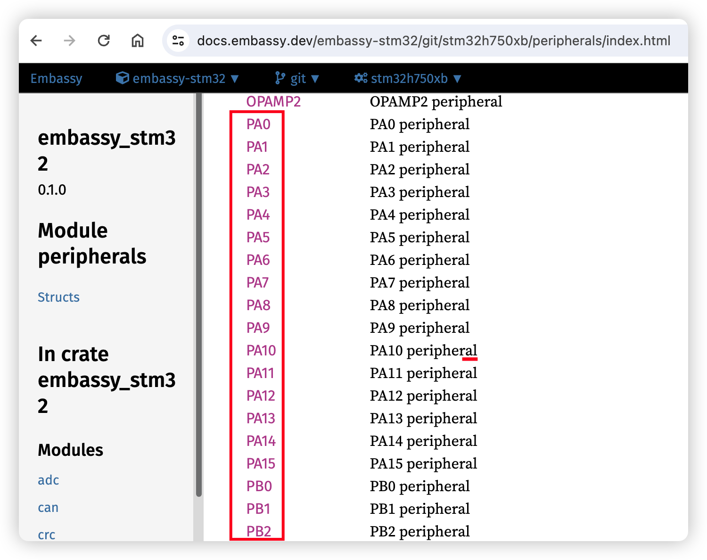

# Keyboard and Matrix Configuration

This section covers the basic keyboard identification and physical matrix configuration in your `keyboard.toml` file.

## Keyboard Information

The `[keyboard]` section defines basic information about your keyboard that appears to the operating system and identifies your device.

### Basic Configuration

```toml
[keyboard]
name = "My Custom Keyboard"    # Display name
vendor_id = 0x4c4b            # USB vendor ID (16-bit hex)
product_id = 0x4643           # USB product ID (16-bit hex)
manufacturer = "YourName"      # Manufacturer string
chip = "nrf52840"             # Target microcontroller
usb_enable = true             # Enable USB functionality
```

### Hardware Selection

You must specify either a `chip` or `board`, but not both:

**Option 1: Specify Chip**

```toml
[keyboard]
chip = "nrf52840"  # Direct chip specification
```

**Option 2: Specify Board**

```toml
[keyboard]
board = "nice!nano_v2"  # Pre-configured board
```

### Supported Hardware

#### Supported Chips

- **Nordic nRF52 Series**: `nrf52840`, `nrf52833`, `nrf52832`, `nrf52811`, `nrf52810`
- **Espressif ESP32 Series**: `esp32c3`, `esp32c6`, `esp32s3`
- **Raspberry Pi**: `rp2040`, `rp2350`
- **STM32 Series**: All STM32 chips supported by [embassy-stm32](https://github.com/embassy-rs/embassy/blob/main/embassy-stm32/Cargo.toml) with USB capability

#### Supported Development Boards

- `nice!nano` - nRF52840-based wireless board
- `nice!nano_v2` - Updated version of nice!nano
- `pi_pico_w` - Raspberry Pi Pico W with WiFi/BLE
- `xiao_ble` - Seeed Studio XIAO nRF52840

### USB Configuration

For chips without full USB functionality (like nRF52832 or ESP32-C3), disable USB:

```toml
[keyboard]
chip = "nrf52832"
usb_enable = false  # Required for chips without USB
```

## Matrix Configuration

The `[matrix]` section defines your keyboard's physical key matrix wiring. This tells RMK which GPIO pins connect to your key switches.

::: tip
**Skip `[matrix]` section for split keyboards**. Use the `[split]` section instead to define matrix configuration for each part.
:::

### Understanding Key Matrix

A keyboard matrix uses diodes to enable multiple key detection. Here's how it works:

```
Output Pin (Column) → |>| → Input Pin (Row)
                      ↑
                   Diode (note direction)
```

::: warning

Per default RMK assumes that your pins are <b>col2row</b>, meaning that the output pins (anodes) represent the columns and the input pins (cathodes) represent the rows. If your schemata shows the opposite you need to <a href="https://rmk.rs/docs/user_guide/faq.html#my-matrix-is-row2col-the-matrix-doesn-t-work"> change the configuration to `row2col`</a>

:::

### Standard Matrix Configuration

For keyboards using a traditional diode matrix:

```toml
[matrix]
# Define matrix pins
input_pins = ["PD4", "PD5", "PD6", "PD3"]
output_pins = ["PD7", "PD8", "PD9"]

# WARNING: Currently row2col/col2row is set in RMK's feature gate, row2col config here is valid ONLY when you're using cloud compilation
# Checkout documentation here: https://rmk.rs/docs/user_guide/faq.html#my-matrix-is-row2col-the-matrix-doesn-t-work
# row2col = true  # Uncomment if your matrix is row2col
```

**Important Notes:**

- `input_pins` correspond to rows in col2row configuration (default)
- `output_pins` correspond to columns in col2row configuration (default)
- If using `row2col = true`, the roles are reversed

### Finding GPIO Pin Names

GPIO pin names vary by microcontroller. Here are the correct formats for each supported chip series:

**Examples by Chip Series:**

- **STM32**: `PA0`, `PB1`, `PC2`, etc.
- **nRF52**: `P0_00`, `P0_01`, `P1_15`, etc.
- **RP2040/RP2350**: `PIN_0`, `PIN_1`, `PIN_28`, etc.
- **ESP32**: `GPIO0`, `GPIO1`, `GPIO21`, etc.

**Finding Pin Names:**

1. Visit [Embassy docs](https://docs.embassy.dev/)
2. Navigate to your specific chip (e.g., `embassy-stm32/stm32h750xb`)
3. Check the peripherals module for valid GPIO pin names:
   

### Matrix Type Configuration

RMK supports two matrix types:

```toml
[matrix]
# Default: normal matrix with diodes
# matrix_type = "normal"  # This is the default, can be omitted

# Or: direct pin connection (no matrix)
matrix_type = "direct_pin"
```

### Direct Pin Configuration

For keyboards where each switch connects directly to a GPIO pin (no matrix):

```toml
[matrix]
matrix_type = "direct_pin"

# 2D array representing your direct-pin matrix
direct_pins = [
    ["PIN_0", "PIN_1", "PIN_2"],
    ["PIN_3", "_",     "PIN_5"]
]

# Pin behavior (default: true = active low with pull-up)
direct_pin_low_active = true
```

**Direct Pin Behavior:**

- `true` (default): The pin is pulled high by default, pressing a key pulls it to low
- `false`: The pin is pulled low by default, pressing a key pulls it to high
- Use `"_"` or `"trns"` for unused positions in the matrix

## Vial Security Configuration - `[security]` Section

For enhanced security, Vial locks certain functions (like matrix testing) by default. You can set a key combination to unlock it.

```toml
[security]
# Unlock combination: simultaneous press of specified keys
# Format: [[row, col], [row, col], ...]
unlock_keys = [[0, 0], [0, 1]]  # Keys at (row=0,col=0) and (row=0,col=1)
```

## Troubleshooting

### Common Issues

**Wrong GPIO Pin Names:**

- Check embassy documentation for your specific chip
- Ensure pin names match exactly (case-sensitive)
- Verify pins support GPIO functionality
- Use correct format: `P0_00` (nRF52), `PIN_0` (RP2040), `PA0` (STM32), `GPIO0` (ESP32)
- For nRF52, some pins are behind a feature gate, for example `P0_09/P0_10` are used as NFC pins by default. To use it as a normal pin in matrix, you should enable corresponding features(for example, [nfc-pins-as-gpio](https://github.com/embassy-rs/embassy/blob/main/embassy-nrf/Cargo.toml#L86)) for `embassy-nrf` dependency.

**Matrix Not Working:**

- Verify diode direction in your schematic
- Check if you need `row2col = true`
- For local compilation with row2col, add the `row2col` feature to Cargo.toml

**Direct Pins Not Working:**

- Verify `matrix_type = "direct_pin"` is set
- Check `direct_pin_low_active` setting matches your hardware
- Ensure unused positions use `"_"` or `"trns"`
