# Input devices

The definition of input devices varies, but for RMK, we focus on two categories: keys and sensors.

-	Keys are straightforward—they are essentially switches with two states.
-	Sensors, on the other hand, are more complex. Devices such as joysticks, mice, trackpads, and trackballs are all sensors. They produce different data and speak different protocols.

RMK’s input device framework is designed to provide a simple yet extensible way to handle both keys and sensors. Below is an overview of the framework:



At first glance, the framework looks simple. However, as we delve into the implementation, intricacies emerge. In this documentation, we will focus on the left half of the diagram: `InputDevices` and `InputProcessors`. Key areas of complexity include:

This design document outlines the current implementation, which aims to make RMK’s input device system clear, easy to use, and extensible.

## Input device trait

The input devices can be key matrix or sensors, which read the physical devices, send raw events to the input processors. All input devices in RMK should implement the `InputDevice` trait:

```rust
pub trait InputDevice {
    /// Event type that input device will send 
    type EventType;

    /// Starts the input device task.
    ///
    /// This asynchronous method should contain the main logic for the input device.
    /// It will be executed concurrently with other input devices using the `run_devices` macro.
    fn run(&mut self) -> impl Future<Output = ()>;

    /// Get the event channel for the input device. All events should be send by this channel.
    fn get_channel(&self) -> &Channel<CriticalSectionRawMutex, Self::EventType, EVENT_CHANNEL_SIZE>;
}
```

This trait should be used with the `run_devices!` macro:

```rust
// Suppose that the d1 & d2 both implement `InputDevice`. `run()` will be called in `run_devices!`
run_devices!(d1, d2).await;
```

> Why `run_devices!`?
>
> Currently, embassy-rs does not support generic tasks. So the only option is to join all tasks(aka `run` function in `InputDevice`) together. That's what `run_devices!` does.


Another thing that need to be mentioned is that every input device defines its own `EventType`. RMK provides a default Event enum, which is compatible with built-in InputProcessors. This design balances convenience and flexibility:

- For common devices, developers can use the built-in `Event` and `InputProcessor` implementations to when implementing new `InputDevice`
- For advanced use cases, developers can define custom events and processors to fully control the input logic.

## Event

The event is the output of input devices. It's defined as a non-exhaustive enum:

```rust
#[non_exhaustive]
#[derive(Serialize, Deserialize, Clone, Debug)]
pub enum Event {
    /// Keyboard event
    Key(KeyEvent),
    /// Rotary encoder, ec11 compatible models
    RotaryEncoder(RotaryEncoderEvent),
    /// Multi-touch touchpad
    Touchpad(TouchpadEvent),
    /// Joystick, suppose we have x,y,z axes for this joystick
    Joystick([AxisEvent; 3]),
    /// An AxisEvent in a stream of events. The receiver should keep receiving events until it receives [`Eos`] event.
    AxisEventStream(AxisEvent),
    /// End of the event sequence
    ///
    /// This is used with [`AxisEventStream`] to indicate the end of the event sequence.
    Eos,
}
```

The `Event` aims to include raw outputs of all commonly used input devices, such as mice, trackpads, joysticks, etc. It also provides a stream-like axis event representation `AxisEventStream`, which can be used for a multiple-axis device where the number of axes is not known. Note that when using this, the `Eos` should be sent the indicate the end of the event sequence, otherwise the `InputProcessor` would wait for the next event forever.

## Input processor trait

The input processors receive the event from input devices, process them and convert results to HID reports for USB/BLE transmission. All input processors should implement the `InputProcessor` trait:

```rust
pub trait InputProcessor {
  /// Event type that the input processor receives.
    type EventType;

    /// Process the incoming events, convert them to HID report [`KeyboardReportMessage`],
    /// then send the report to the USB/BLE.
    ///
    /// Note there might be mulitple HID reports are generated for one event,
    /// so the "sending report" operation should be done in the `process` method.
    /// The input processor implementor should be aware of this.  
    fn process(&mut self, event: Self::EventType) -> impl Future<Output = ()>;

    /// Get the input event channel for the input processor.
    ///
    /// The input processor receives events from this channel, processes the event,
    /// then sends to the report channel.
    fn get_event_channel(
        &self,
    ) -> &Channel<CriticalSectionRawMutex, Self::EventType, EVENT_CHANNEL_SIZE>;

    /// Get the output report channel for the input processor.
    ///
    /// The input processor sends keyboard reports to this channel.
    fn get_report_channel(
        &self,
    ) -> &Channel<CriticalSectionRawMutex, KeyboardReportMessage, REPORT_CHANNEL_SIZE> {
        &KEYBOARD_REPORT_CHANNEL
    }

    /// Default implementation of the input processor. It wait for a new event from the event channel,
    /// then process the event.
    ///
    /// The report is sent to the USB/BLE in the `process` method.
    fn run(&mut self) -> impl Future<Output = ()> {
        async {
            loop {
                let event = self.get_event_channel().receive().await;
                self.process(event).await;
            }
        }
    }
}
```

The `process` method is responsible for processing input events and sending HID report to the report channel, which is available by `get_report_channel`.

## TODO

-  Sometimes, we need different `InputProcessor`s for SAME `Event` from different `InputDevice`s. How to realize it?
