# Developing :USB & BLE dual mode

BLE & USB should both be used for microcontrollers like nrf52840, with manually or automatically switching.

The user side operation logic should be like:

In one word, USB has higher priority to BLE. If there is a USB cable connected, the keyboard should never use BLE. If the USB cable is removed, then the keyboard should behavior like restarting, do BLE advertising and then connect to known host.