# Contributing

ANY contributions are welcome! There is a simple step by step guide for developers:

1. Before you start, you may want to read the [under the hood] section to understand how RMK works. [Github Issue](https://github.com/haobogu/rmk/issues) is also a good place for questions.

2. Checkout the active PRs, make sure that what you want to add isn't implemented by others.

3. Write your code!

4. Open a PR merging your code to main repo, make sure all CIs pass.

## Under the hood

If you're not familiar with RMK, the following is a simple introduction of source code of RMK.

### Project architecture

There're three crates in RMK project, `rmk`, `rmk-config` and `rmk-macro`.

`rmk-config` crate is the dependency of both `rmk` and `rmk-macro`, it includes both toml configs used in `keyboard.toml` and normal config used in RMK core. `rmk-macro` is a proc-macro helper of RMK, it reads `keyboard.toml` config file and converts toml config to RMK config, generates the boilerplate code. The core of RMK stays in `rmk` crate.

  

So, if you want to contribute new features of RMK, just look into `rmk` core crate. If you want to add new chip support, `rmk` and `rmk-macro` should be updated, so that users could use `keyboard.toml` to config keyboard with your new chip. And, if you want to add new configurations, look into `rmk-config`.

### RMK core

`rmk` crate is the main crate, it provides several entry API to start the keyboard firmware. All the entry APIs are similar, it:

- Initialize the storage, keymap and matrix first
- Create services: main keyboard service, matrix service, usb service, ble service, vial service, light service, etc.
- Run all tasks in an infinite loop, if there's a task failed, wait some time and rerun

Generally, there are 4-5 running tasks in the meanwhile, according to the user's config. Communication between tasks is done by channels.There are several built-in channels: 

- `FLASH_CHANNEL`: a multi-sender, single-receiver channel. There are many tasks send the `FlashOperationMessage`, such as BLE task(which saves bond info), vial task(which saves key), etc.
- `key_event_channel`: a multi-sender, single-receiver channel. The sender can be a matrix task which scans the key matrix or a split peripheral monitor which receives key event from split peripheral. The receiver, i.e. keyboard task, receives the key event and processes the key
- `keyboard_report_channel`: a single-sender, single-receiver channel, keyboard task sends keyboard report to channel after the key event is processed, and USB/BLE task receives the keyboard report and sends the key to the host.

### Matrix scanning & key processing

An important part of a keyboard firmware is how it performs [matrix scanning](https://en.wikipedia.org/wiki/Keyboard_matrix_circuit) and how it processes the scanning result to generate keys.

In RMK, this work is done in `Matrix` and `Keyboard` respectively. The `Matrix` scans the key matrix and send `KeyEvent` if there's a key change in matrix. Then the `Keyboard` receives the `KeyEvent` and processes it into actual keyboard report. Finally, the keyboard report is sent to USB/BLE tasks and forwarded to the host via USB/BLE.

